# Cebolão Lotofácil - Architecture Diagram

```mermaid
flowchart TB
    subgraph AndroidSystem["Android System"]
        subgraph Presentation["📱 Presentation Layer (UI)"]
            subgraph Screens["Screens"]
                HomeScreen["🏠 HomeScreen<br/>LastDrawSection<br/>StatisticsSection<br/>WelcomeBanner"]
                FiltersScreen["🎛️ FiltersScreen<br/>FiltersScreenComponents"]
                GeneratedGamesScreen["🎲 GeneratedGamesScreen<br/>GameCard Components"]
                CheckerScreen["✅ CheckerScreen<br/>CheckResultCard"]
                InsightsScreen["📊 FrequencyAnalysisScreen<br/>PatternListSection<br/>TrendSection<br/>RecencyComponents"]
                AboutScreen["ℹ️ AboutScreen<br/>ProbabilitiesTable<br/>InfoItem"]
                UserStatsScreen["👤 UserStatsScreen"]
            end
            subgraph Navigation["Navigation"]
                AppNavigation["AppNavigation (NavHost)"]
                Destination["Destination<br/>- Home<br/>- Filters<br/>- GeneratedGames<br/>- Checker<br/>- About<br/>- Insights<br/>- UserStats"]
                UiEvent["UiEvent"]
            end
            subgraph Components["UI Components"]
                BaseComponents["BaseComponents"]
                GameCard["GameCard"]
                StatCard["StatCard"]
                FilterCard["FilterCard"]
                ErrorCard["ErrorCard"]
                FilterRangeSlider["FilterRangeSlider"]
                GenerationActionsPanel["GenerationActionsPanel"]
                EmptyState["EmptyState"]
            end
            subgraph Theme["Theme / Design"]
                Theme["CebolaoLotofacilTheme"]
                DesignSystem["DesignSystem"]
                Typography["Typography"]
                ColorScheme["ColorScheme<br/>(Lotofácil Purple)"]
            end
        end

        subgraph Domain["🎯 Domain Layer"]
            subgraph UseCases["Use Cases (13)"]
                GenerateGamesUC["GenerateGamesUseCase"]
                CheckGameUC["CheckGameUseCase"]
                GetHistoryUC["GetHistoryUseCase"]
                GetHomeScreenDataUC["GetHomeScreenDataUseCase"]
                GetFrequencyAnalysisUC["GetFrequencyAnalysisUseCase"]
                GetPatternAnalysisUC["GetPatternAnalysisUseCase"]
                GetTrendAnalysisUC["GetTrendAnalysisUseCase"]
                GetSavedGamesUC["GetSavedGamesUseCase"]
                ClearUnpinnedGamesUC["ClearUnpinnedGamesUseCase"]
                DeleteGameUC["DeleteGameUseCase"]
                ToggleGamePinUC["ToggleGamePinUseCase"]
                GetUserGameStatisticsUC["GetUserGameStatisticsUseCase"]
            end
            subgraph RepositoryInterfaces["Repository Interfaces"]
                GameRepoInterface["GameRepository"]
                HistoryRepoInterface["HistoryRepository"]
                StatsRepoInterface["StatisticsRepository"]
                UserPrefsRepoInterface["UserPreferencesRepository"]
            end
            subgraph DomainModels["Domain Models"]
                CheckResult["CheckResult"]
                DomainError["DomainError"]
                GameCheckState["GameCheckState"]
            end
            subgraph Services["Services"]
                DomainServices["Domain Services"]
            end
        end

        subgraph Data["💾 Data Layer"]
            subgraph RepositoriesImpl["Repository Implementations"]
                GameRepoImpl["GameRepositoryImpl"]
                HistoryRepoImpl["HistoryRepositoryImpl"]
                UserPrefsRepoImpl["UserPreferencesRepositoryImpl"]
            end
            subgraph DataSources["Data Sources"]
                LocalDS["HistoryLocalDataSource<br/>(Room Database)"]
                RemoteDS["HistoryRemoteDataSource<br/>(API Service)"]
            end
            subgraph Database["Database (Room)"]
                HistoryDao["@Dao HistoryDao"]
                LotofacilDB["LotofacilDatabase"]
                HistoricalDrawEntity["HistoricalDrawEntity"]
            end
            subgraph Network["Network"]
                ApiService["ApiService<br/>(Retrofit)"]
                LotofacilApiResult["LotofacilApiResult"]
            end
            subgraph Parser["Parser"]
                HistoryParser["HistoryParser"]
            end
        end

        subgraph DI["🔧 Dependency Injection (Hilt)"]
            AppModule["AppModule"]
            DataSourceModule["DataSourceModule"]
            DatabaseModule["DatabaseModule"]
            NetworkModule["NetworkModule"]
            RepositoryModule["RepositoryModule"]
            UtilityModule["UtilityModule"]
            ApplicationScope["ApplicationScope"]
        end

        subgraph ViewModels["🧠 ViewModels (Hilt)"]
            MainVM["MainViewModel<br/>(Splash/App State)"]
            HomeVM["HomeViewModel<br/>(Home Screen)"]
            FiltersVM["FiltersViewModel<br/>(Filter Config)"]
            GameVM["GameViewModel<br/>(Saved Games)"]
            CheckerVM["CheckerViewModel<br/>(Game Checking)"]
            InsightsVM["InsightsViewModel<br/>(Analytics)"]
            UserStatsVM["UserStatsViewModel<br/>(User Statistics)"]
            BaseVM["BaseViewModel<br/>(Common Functionality)"]
        end

        subgraph Core["⚙️ Core"]
            AppConstants["AppConstants"]
            AppResult["AppResult<br/>(Sealed Result)"]
            AppError["AppError"]
            ErrorMapper["ErrorMapper"]
            DispatchersProvider["DispatchersProvider"]
            NumberFormatUtils["NumberFormatUtils"]
        end

        subgraph Application["🚀 Application"]
            CebolaoApplication["CebolaoApplication<br/>@HiltAndroidApp"]
            MainActivity["MainActivity<br/>@AndroidEntryPoint"]
        end
    end

    %% Flow connections
    MainActivity --> Screens
    MainActivity --> ViewModels
    
    Screens --> ViewModels
    ViewModels --> UseCases
    UseCases --> RepositoryInterfaces
    RepositoryInterfaces --> RepositoriesImpl
    RepositoriesImpl --> DataSources
    
    DataSources --> Database
    DataSources --> Network
    RemoteDS --> ApiService
    LocalDS --> HistoryDao
    Network --> HistoryParser
    
    DI --> ViewModels
    DI --> UseCases
    DI --> RepositoriesImpl
    DI --> DataSources
    DI --> Database
    DI --> Network
    
    AppNavigation --> Destination
    Screens --> AppNavigation
    
    Core --> ViewModels
    Core --> UseCases
    Core --> Data
    
    ViewModels --> BaseVM
    
    Theme --> Screens
    DesignSystem --> Theme
    Typography --> Theme
    ColorScheme --> Theme
    
    Components --> Screens
    
    %% Styling
    style Presentation fill:#e1f5fe
    style Domain fill:#f3e5f5
    style Data fill:#e8f5e9
    style DI fill:#fff3e0
    style ViewModels fill:#fce4ec
    style Core fill:#f5f5f5
    style AndroidSystem fill:#fafafa,stroke:#333,stroke-width:2px
```

## Layer Dependencies

```mermaid
flowchart LR
    subgraph Architecture["Clean Architecture"]
        UI["📱 UI Layer<br/>(Compose Screens,<br/>ViewModels,<br/>Navigation)"]
        Domain["🎯 Domain Layer<br/>(UseCases,<br/>Repository Interfaces,<br/>Models)"]
        Data["💾 Data Layer<br/>(Repositories Impl,<br/>DataSources,<br/>Database, API)"]
    end
    
    UI -->|uses| Domain
    Domain -.->|interfaces| Data
    
    subgraph External["External"]
        Android["Android OS"]
        LotofacilAPI["Lotofacil API<br/>(CAIXA)"]
        LocalDB["SQLite (Room)"]
    end
    
    Data -->|calls| LotofacilAPI
    Data -->|queries| LocalDB
    UI -->|runs on| Android
```



## Feature Flow: Generate Games


## Navigation Graph

```mermaid
flowchart LR
    Home["🏠 Home"]
    Filters["🎛️ Filters"]
    Generated["🎲 Generated Games"]
    Checker["✅ Checker"]
    About["ℹ️ About"]
    Insights["📊 Insights"]
    UserStats["👤 User Stats"]
    
    Home -->|Explore Filters| Filters
    Home -->|Open Checker| Checker
    Home -->|View Insights| Insights
    
    Filters -->|Generate| Generated
    
    About -->|View Stats| UserStats
    
    Insights -->|Back| Home
    UserStats -->|Back| About
    Checker -->|Back| Home
    Generated -->|Back| Home
```



## Database Schema


## Technology Stack

| Layer | Technology |
|-------|------------|
| Language | Kotlin 2.0.0 |
| UI Framework | Jetpack Compose |
| Architecture | MVVM + Clean Architecture |
| DI | Hilt |
| Networking | Retrofit |
| Database | Room (SQLite) |
| Concurrency | Kotlin Coroutines |
| Navigation | Compose Navigation (Type-safe) |
| Min SDK | API 26 (Android 8.0) |
