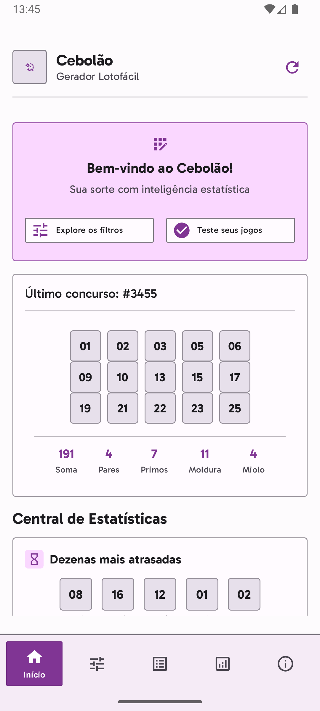
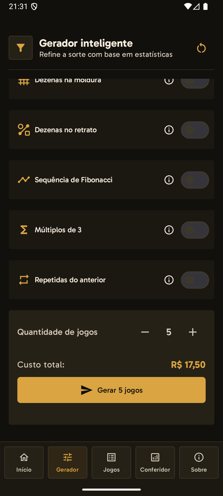
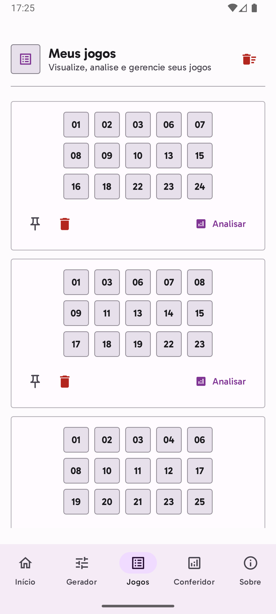
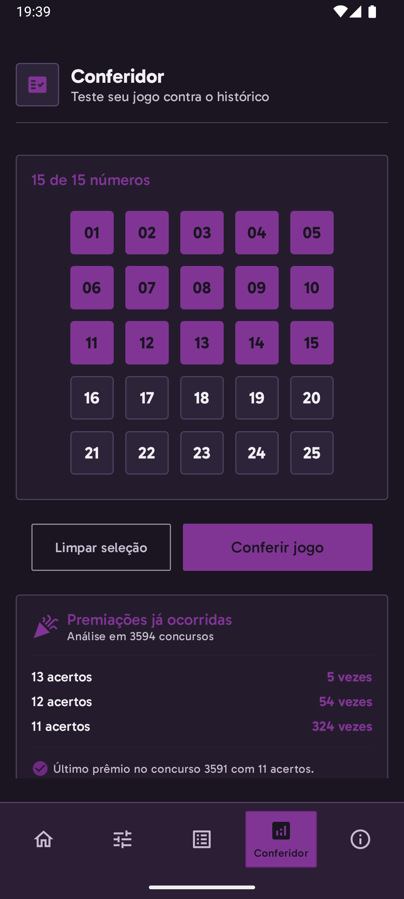

# 🎲 Cebolao Lotofácil Generator

Uma solução da Cebola Studios para gerar jogos da Lotofácil com base em estatísticas. Porque a sorte é para amadores, mas a matemática, bem, ela também não promete milagres.


## ✨ Funcionalidades Principais

-   **🧮 Gerador Inteligente:** Crie jogos com até 9 filtros estatísticos baseados em dados históricos.
-   **🔍 Conferidor de Desempenho:** Teste seus jogos contra o histórico de sorteios e veja se sua intuição é boa mesmo.
-   **📊 Análises e Tendências:** Explore padrões, números "quentes" e "frios", e outras estatísticas (para se iludir com mais embasamento).
-   **🎨 Interface Moderna:** Desenvolvida com Jetpack Compose, tema escuro e design acessível.
-   **⚠️ Validações e Avisos:** O app avisa quando seus filtros são tão restritivos que nem a matemática consegue ajudar.

## 🛠️ Stack de Tecnologia

-   **Linguagem**: Kotlin (com Coroutines para concorrência)
-   **UI**: Jetpack Compose
-   **Arquitetura**: MVVM com Clean Architecture (UseCases, Repositories, DataSources)
-   **Injeção de Dependência**: Hilt
-   **Testes**: JUnit4 & Espresso

## 📸 Screenshots

<table>
  <tr>
    <td></td>
    <td></td>
    <td></td>
    <td></td>
  </tr>
</table>

## 🚀 Instalação

1.  Clone o repositório: `git clone https://github.com/cebola-studios/cebolao-generator.git`
2.  Abra o projeto no Android Studio e aguarde a sincronização do Gradle.
3.  Compile o projeto: `./gradlew build` (Certifique-se de usar o JDK 17)
4.  Execute no seu emulador ou dispositivo.

## 🏗️ Estrutura do Projeto

-   `app/src/main/java/com/cebolao/lotofacil/`:
    -   `data/`: Implementações de repositórios e fontes de dados (local/remoto).
    -   `di/`: Módulos de injeção de dependência (Hilt).
    -   `domain/`: Lógica de negócio, interfaces de repositório e UseCases.
    -   `ui/`: Componentes, telas e ViewModels (Jetpack Compose).
    -   `navigation/`: Lógica de navegação do app.
-   `app/src/test/`: Testes unitários.
-   `app/src/androidTest/`: Testes de instrumentação.

## 🧪 Testes

Para executar todos os testes unitários e de instrumentação, utilize:
```bash
./gradlew test connectedCheck
```

## 📄 Licença

Este projeto está sob a licença MIT. Jogue com responsabilidade. A Cebola Studios não se responsabiliza por apostas perdidas, sonhos desfeitos ou discussões sobre qual número é "mais provável".

---
Desenvolvido com 🧅 e ☕ pela Cebola Studios.